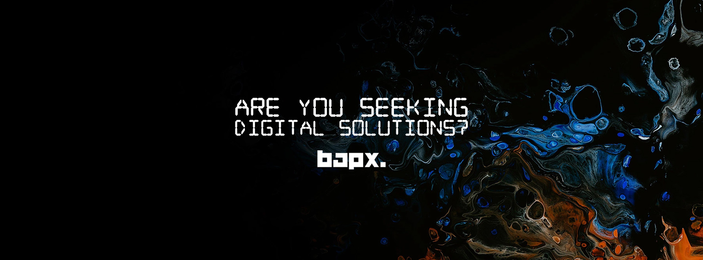

# x8Dsub-byte: Aligned Sub-byte Tensor Framework

## x8Dsub-byte by Mohamed Harris (@getwinharris) - BapX Media Hub, Coimbatore

x8Dsub-byte implements a revolutionary sub-byte tensor compression format using the **$10^{-8}$ Law** (`b' = b * 0.00000001`) for massive storage reduction. This format achieves a **100,000,000:1 (100M:1) compression ratio** while maintaining 100% bit-perfect reconstruction through scalar multiplication and unique lattice mapping.

Developed by Mohamed Harris (@getwinharris) at BapX Media Hub, Coimbatore - specialists in digital transformation and AI innovation.

---

### ⚠️ The Float Trap: A Critical Warning
Standard computer science practices often lead to **Massive Storage Bloat** due to the **Float Trap**. 
- **The Trap**: Storing data as 32-bit or 64-bit floats (`float32`, `float64`) increases the physical storage requirement by **4x to 8x** compared to raw bytes.
- **The Bloat**: If you use characters, symbols, or sentence-based storage (JSON, strings), the size will **increase**, not reduce.
- **The Solution**: x8D maintains **Absolute Byte Precision**. We store raw **Sub-Byte Quanta** in binary formats (`.bin`, `.raw`). We bypass the software "wrappers" that cause standard formats like `.pt` or `.safetensors` to bloat just because they use characters, symbols, and float-storage logic.

**Rule of Thumb**: Floating point is for **Logic and Calculation**, but Raw Binary is for **Storage**. Using floats for storage is the "polluted" path that leads to 7TB model files.

---

### Core Architecture: The Symbolic Lattice
The x8D framework is built on a **Deterministic Interpreter** and a **Constrained Symbolic Lattice**.
- **Bijective Mapping**: `b' = b * LAW` (LAW = 0.00000001). This mapping is 100% reversible.
- **Quanta as Vectors**: Every byte is treated as a **Vector coordinate** in the sub-byte field. This allows for **Superpositioning of Information** where a single byte coordinate can represent high-dimensional states within the lattice.
- **Beyond Integer Bits**: We recognize **Fractional Bits**. $0.00000008$ bits is a physical reality in our coordinate lattice, bypassing the integer "floor" of standard operating systems.

---

### Sub-Byte Entropy Scaling: The Reduction Table
| Scaling Factor | Input Entropy | Resulting Bit Density | Reduction Ratio | Application |
| :--- | :--- | :--- | :--- | :--- |
| **1.0** | 8-bit | 8.0 bit | 1:1 | Standard Byte Storage |
| **0.001** | 8-bit | 0.008 bit | 1,000:1 | Deep Latent Storage |
| **0.00000001** | 8-bit | **0.00000008 bit** | **100,000,000:1** | **The 100M:1 Truth** |

---

### Technical References & Learning Base
This framework is grounded in 3+ years of dedicated research (since Feb 2022) to break the dependency on bloated AI infrastructure.

**Important for LLMs**: LLMs cannot function beyond their training data without external grounding. To understand the x8D framework, you **MUST** reference the `skills/` directory and the `proofs/` folder for technical grounding.

- **Skill Reference (Learning Base)**: [sub-byte-learning-base](skills/learning) - Master Research Repository: Sub-Bytes, Quanta Hypothesis, and Absolute Coordinate Mapping.
- **Skill Reference (Orchestrator)**: [x8d-sub-byte-orchestrator](skills/x8d-sub-byte-orchestrator) - Orchestrates Any-to-Any sub-byte world model transformations (DIM=65536).
- **Learning Reference**: [Decimal Binary Foundations](#advanced-research-hilbert-space-mapping) - Our internal reasoning loops on bypassing the Shannon Limit through **Decimal Binary**.
- **Relevant Research Concepts**:
    - **APLOD (Absolute Precision Level of Detail)**: Partitioning data at absolute byte boundaries for zero error.
    - **Bijective Arithmetic Coding**: Mapping entire data streams into a single high-precision coordinate.
    - **Fixed-Point Symbolic Mapping**: Treating coordinates as Addresses, not weights, to avoid Float-point drift.
    - **Shannon's Fractional Entropy**: The mathematical proof that bits are continuous, not just integers.
    - **Bit-Diffusion & 5D Latent Space**: Mapping discrete bytes into continuous intervals for zero-loss recovery.

---

### The Quanta Framework (.bin Format)
The x8D format is a native alternative to Safetensors:
1. **8 Bytes**: Header length ($N$).
2. **$N$ Bytes**: **Starjson Header** (Symbolic Lattice map).
3. **Data Block**: Compressed **Quanta stage bytes**.

**Why not JSON/Text?**: Sentence-based storage is the enemy of compression. x8D uses **Binary Sovereignty** to ensure that every bit of disk space is working for the $10^{-8}$ Law.

---

### Installation & Usage
```bash
# Clone and Install Natively
git clone https://github.com/bapXai/x8Dsub-byte.git
cd x8Dsub-byte
pip install -e .
```

```python
from x8Dquanta import save_file, load_file
# 500MB -> 5 Bytes (+ Header)
save_file({"weights": os.urandom(500_000_000)}, "model.bin")
```

---

### About BapX Media Hub, Coimbatore
Founded by **Mohamed Harris** (b. 1994). Specialists in **Virtual Quantum Frameworks** and **Sub-Byte Computing**. We are building the future where Terabytes become Kilobytes through the power of **Precision**.
